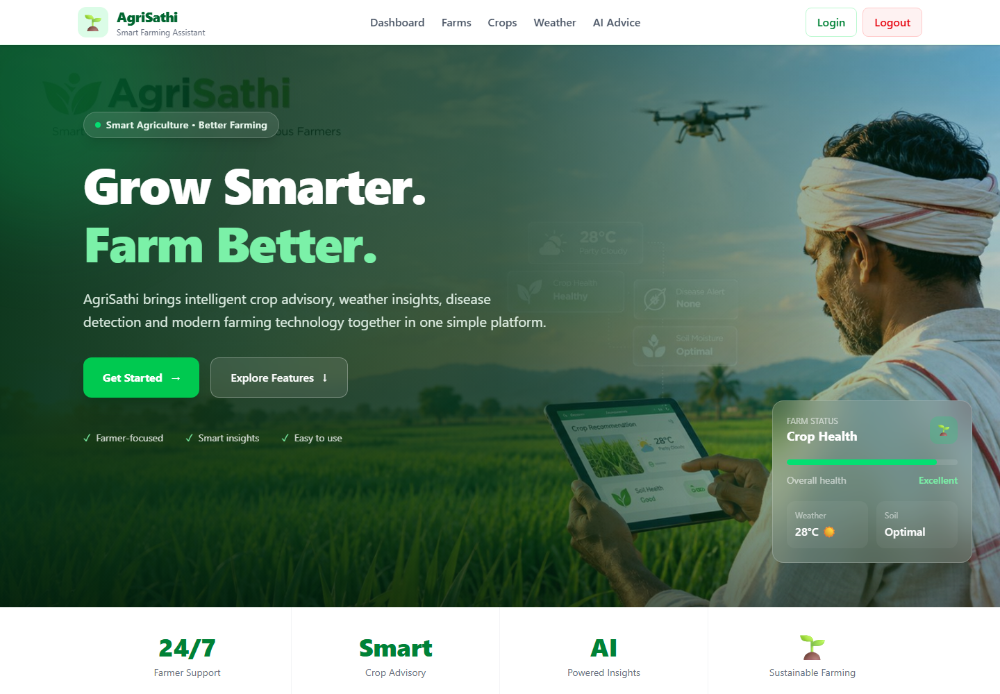
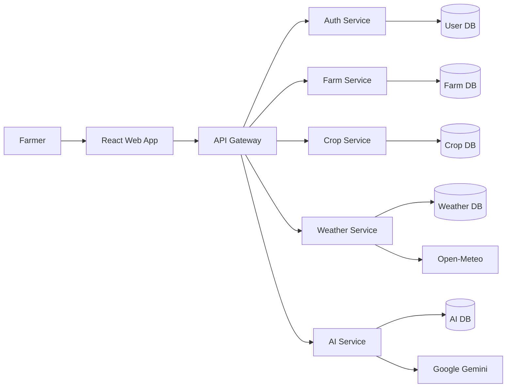
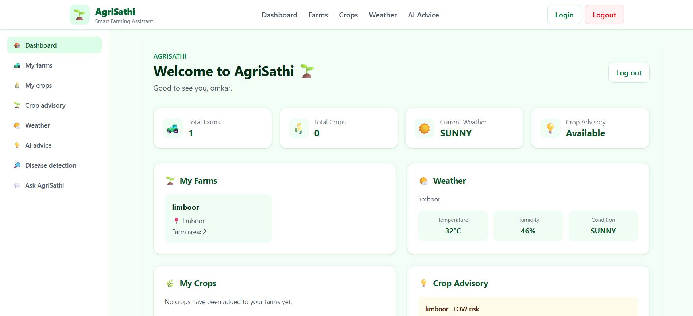

# AgriSathi

AgriSathi is a farmer-assistance platform for managing farms and crops,
checking weather, and getting AI-powered farming advice.



## Run the Application

### 1. Install the Requirements

Make sure you have the following installed:

- Java 21 and Maven
- Node.js and npm
- MySQL
- Google Gemini API key for AI features

### 2. Start MySQL and Configure the Application

Start MySQL on `localhost:3306`.

The default MySQL settings are:

- **Username:** `root`
- **Password:** `root`
- **Host:** `localhost`
- **Port:** `3306`

If your MySQL settings are different, set the following environment variables:

| Variable | Purpose |
| --- | --- |
| `DB_HOST` | MySQL host |
| `DB_PORT` | MySQL port |
| `DB_USERNAME` | MySQL username |
| `DB_PASSWORD` | MySQL password |
| `JWT_SECRET` | Secret key used for JWT authentication |
| `GEMINI_API_KEY` | Google Gemini API key |

The default values are:

```text
DB_HOST=localhost
DB_PORT=3306
DB_USERNAME=root
DB_PASSWORD=root
```

Each backend service uses its own MySQL database.

Set the same `JWT_SECRET` value for all backend services and the API Gateway.

> Do not add real passwords, API keys, or other private credentials to the
> source code or GitHub repository.

### 3. Start the Backend Services

Start each service in a separate terminal.

Run the services in the following order:

| Order | Folder | Command | Port |
| --- | --- | --- | ---: |
| 1 | `ServiceDiscovery` | `mvn spring-boot:run` | `8761` |
| 2 | `Auth_Service` | `mvn spring-boot:run` | `8081` |
| 3 | `Farm_Service` | `mvn spring-boot:run` | `8082` |
| 4 | `Crop_Service` | `mvn spring-boot:run` | `8083` |
| 5 | `Weather_Service` | `mvn spring-boot:run` | `8084` |
| 6 | `AI_Service` | `mvn spring-boot:run` | `8085` |
| 7 | `APIGateway` | `mvn spring-boot:run` | `8080` |

Eureka Server runs at:

```text
http://localhost:8761
```

Start `ServiceDiscovery` first so that the other services can register with
Eureka.

### 4. Start the Frontend

Open a new terminal and go to the frontend folder:

```sh
cd frontend
```

Install the required packages:

```sh
npm install
```

Start the React application:

```sh
npm run dev
```

The application will usually be available at:

```text
http://localhost:5173
```

The frontend sends API requests through:

```text
http://localhost:8080
```

## Architecture

AgriSathi uses a simple microservices architecture.

The React application communicates with the backend through the API Gateway.
Each service is responsible for a specific part of the application and has its
own database.



### Main Components

- **React Web App** – Interface used by farmers.
- **API Gateway** – Sends requests to the correct backend service.
- **Auth Service** – Handles user registration and login.
- **Farm Service** – Manages farm information.
- **Crop Service** – Manages crop information.
- **Weather Service** – Gets weather information from Open-Meteo.
- **AI Service** – Provides AI-based farming suggestions using Google Gemini.
- **MySQL Databases** – Store data for the different services.
- **Eureka Server** – Helps backend services find and communicate with each
  other.

## API Reference

All API requests should be sent through:

```text
http://localhost:8080
```

After registration or login, the user receives a JWT token.

For protected APIs, send the token using:

```text
Authorization: Bearer <token>
```

Registration and login do not require a token.

### Authentication — `/auth`

| Method | Endpoint | Purpose |
| --- | --- | --- |
| `POST` | `/auth/register` | Create a new user account |
| `POST` | `/auth/login` | Login and receive a JWT token |
| `GET` | `/auth` | Get all users |
| `GET` | `/auth/{authId}` | Get a user by ID |
| `GET` | `/auth/email/{email}` | Find a user by email |
| `PUT` | `/auth/{authId}` | Update user profile |
| `DELETE` | `/auth/{authId}` | Delete a user |
| `PUT` | `/auth/{authId}/activate` | Activate a user account |
| `PUT` | `/auth/{authId}/deactivate` | Deactivate a user account |
| `PUT` | `/auth/{authId}/role?role=USER` | Change user role |

#### Register Example

```json
{
  "name": "John",
  "email": "john@example.com",
  "password": "password123",
  "phone": "9876543210"
}
```

#### Login Example

```json
{
  "email": "john@example.com",
  "password": "password123"
}
```

---

### Farms — `/farm`

| Method | Endpoint | Purpose |
| --- | --- | --- |
| `POST` | `/farm` | Create a farm |
| `GET` | `/farm` | Get all farms |
| `GET` | `/farm/{farmId}` | Get a farm by ID |
| `GET` | `/farm/auth/{authId}` | Get farms of a user |
| `GET` | `/farm/{farmId}/location` | Get farm location |
| `PUT` | `/farm/{farmId}` | Update a farm |
| `DELETE` | `/farm/{farmId}` | Delete a farm |

#### Create Farm Example

```json
{
  "farmName": "Green Valley",
  "authId": 1,
  "latitude": 18.52,
  "longitude": 73.85,
  "totalArea": 5.5,
  "soilType": "BLACK"
}
```

---

### Crops — `/crop`

| Method | Endpoint | Purpose |
| --- | --- | --- |
| `POST` | `/crop` | Add a crop |
| `GET` | `/crop` | Get all crops |
| `GET` | `/crop/{cropId}` | Get a crop by ID |
| `GET` | `/crop/farm/{farmId}` | Get crops of a farm |
| `GET` | `/crop/status/{status}` | Get crops by status |
| `GET` | `/crop/name/{cropName}` | Get crops by name |
| `PUT` | `/crop/{cropId}` | Update a crop |
| `PUT` | `/crop/{cropId}/status?status=HARVESTED` | Update crop status |
| `DELETE` | `/crop/{cropId}` | Delete a crop |

#### Create Crop Example

```json
{
  "farmId": 1,
  "cropName": "WHEAT",
  "season": "RABI",
  "plantingDate": "2026-10-15",
  "expectedHarvestDate": "2027-03-20",
  "areaPlanted": 2.5
}
```

Some crop statuses include:

```text
PLANTED
GROWING
HARVESTED
```

---

### Weather — `/weather`

| Method | Endpoint | Purpose |
| --- | --- | --- |
| `GET` | `/weather/current/{farmId}` | Get current weather |
| `GET` | `/weather/forecast/{farmId}` | Get weather forecast |
| `GET` | `/weather/farm/{farmId}` | Get stored weather history |
| `GET` | `/weather/records/{farmId}` | Get weather records |
| `POST` | `/weather/refresh/{farmId}` | Refresh weather data |
| `POST` | `/weather` | Store weather information |

The Weather Service gets weather information from **Open-Meteo** using the
farm's location.

---

### AI Features — `/ai`

| Method | Endpoint | Purpose |
| --- | --- | --- |
| `POST` | `/ai/crop-health/analyze` | Analyze crop health |
| `POST` | `/ai/crop-health/{farmId}` | Analyze crops using farm data |
| `POST` | `/ai/crop-recommendation` | Recommend suitable crops |
| `POST` | `/ai/disease-detection/analyze` | Detect possible crop diseases |
| `POST` | `/ai/disease-detection/upload` | Detect disease from an uploaded image |
| `POST` | `/ai/fertilizer-recommendation` | Recommend fertilizer |
| `POST` | `/ai/irrigation-recommendation` | Recommend irrigation |
| `POST` | `/ai/yield-prediction` | Predict crop yield |
| `POST` | `/ai/weather-advice` | Provide weather-based advice |
| `GET` | `/ai/weather-advice/{farmId}` | Provide advice using farm weather |
| `GET` | `/ai/farm-health/{farmId}` | Get farm health information |
| `POST` | `/ai/assistant` | Ask questions to the farming assistant |

#### Farming Assistant Example

```json
{
  "farmId": 1,
  "question": "When should I sow mustard?"
}
```

AI features require a valid:

```text
GEMINI_API_KEY
```

## Project Structure

```text
AgriSathi/
│
├── frontend/
│   └── React Web Application
│
├── APIGateway/
│   └── API Gateway
│
├── ServiceDiscovery/
│   └── Eureka Server
│
├── Auth_Service/
│   └── User Authentication
│
├── Farm_Service/
│   └── Farm Management
│
├── Crop_Service/
│   └── Crop Management
│
├── Weather_Service/
│   └── Weather Information
│
├── AI_Service/
│   └── AI Features
│
└── docs/
    └── screenshots/
```

## Technologies Used

### Frontend

- React
- JavaScript
- HTML
- CSS
- Vite

### Backend

- Java 21
- Spring Boot
- Spring Cloud
- Spring Security
- Spring Data JPA
- Maven

### Database

- MySQL

### Other Technologies

- Eureka Service Discovery
- JWT Authentication
- Open-Meteo API
- Google Gemini API

## External APIs

### Open-Meteo

Used by the Weather Service to get weather information based on the farm's
latitude and longitude.

### Google Gemini

Used by the AI Service to provide farming recommendations and other
AI-based features.

## Screenshots

### Home Page


### Dashboard


## Project Folders

| Folder | Description |
| --- | --- |
| `frontend` | React web application |
| `APIGateway` | API Gateway and JWT validation |
| `ServiceDiscovery` | Eureka service registry |
| `Auth_Service` | User authentication |
| `Farm_Service` | Farm management |
| `Crop_Service` | Crop management |
| `Weather_Service` | Weather information |
| `AI_Service` | AI-based farming features |
| `docs/screenshots` | Application screenshots |

## Notes

- Start the Eureka Server before starting the other backend services.
- Start the API Gateway after the backend services are running.
- Make sure MySQL is running before starting the services.
- Set `JWT_SECRET` to the same value for all backend services.
- Set `GEMINI_API_KEY` to enable AI features.
- Do not commit passwords, API keys, or other secrets to the repository.